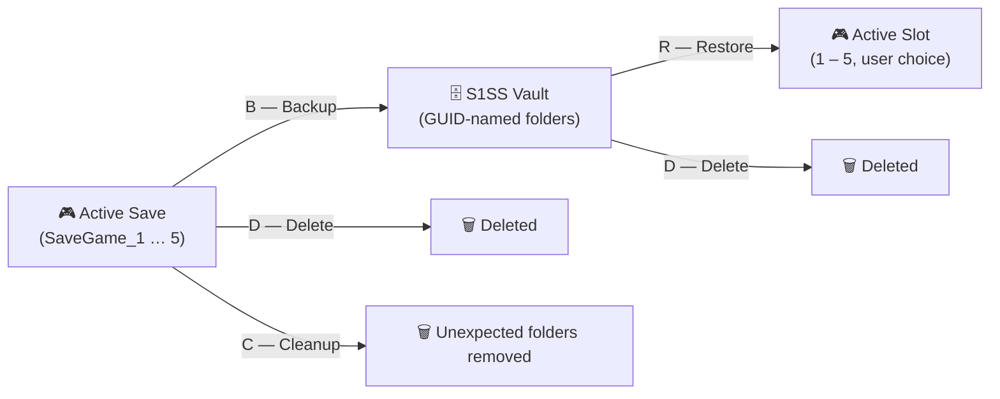

<div align="center">


# Schedule 1 Save Support (S1SS)

**PowerShell save management for Schedule 1 — backups, vault, and restore. No save editing.**

[](https://learn.microsoft.com/en-us/powershell/)
[](https://www.microsoft.com/windows)
[](LICENSE)
[](https://github.com/Quadstronaut/Schedule1SaveSupport/commits/master)
[](https://github.com/Quadstronaut/Schedule1SaveSupport)
[](https://github.com/Quadstronaut/Schedule1SaveSupport)

---

[](#-features)
[](#-getting-started)
[](#%EF%B8%8F-usage)
[](#-file-paths)
[](#-save-data-shown)
[](#-contributing)

</div>

---

## At a Glance

| Capability | Details |
|---|---|
| **Backup** | Copy any active save to the unlimited vault |
| **Restore** | Bring any vaulted save back to a game slot (1–5) |
| **Delete** | Remove individual saves — active, vaulted, or unexpected |
| **Cleanup** | Purge all unexpected folders from the Saves directory |
| **Show** | Display all saves with full metadata in a table |
| **Platform** | PowerShell 5.1+, Windows 10+, run as Administrator |
| **Save editing** | ✗ Not in scope — this tool never modifies save data |

> **Tested on:** Windows 10 OS Build 19045.5796 with PowerShell 5.1.19041.5794.

---

<a id="features"></a>

## ✨ Features

- **Save Listing** — Display all saves with Organisation Name, Game Version, Last Played Date, Elapsed Days, Cash Balance, and Bank Balance.
- **Save Vault** — Back up active saves to an unlimited vault and restore any vaulted save back to a game slot (1–5).
- **Delete** — Remove individual saves from active slots, the vault, or any unexpected folders found in the saves directory.
- **Cleanup** — Remove all unexpected (manually placed) folders found in the game's Saves directory.

> [!IMPORTANT]
> **No save editing — ever.** S1SS copies and restores saves as-is. It does not read, modify, or inject any save file values. If you want a tool that edits saves, this is not it.

---

<a id="getting-started"></a>

## 🚀 Getting Started

1. Download `saveSupport.ps1`.
2. Right-click the script and choose **Run with PowerShell** — or open an elevated PowerShell window, navigate to the script, and run:

   ```powershell
   .\saveSupport.ps1
   ```

3. The interactive menu lists available actions based on what saves exist.

> [!WARNING]
> **Administrator rights are required** for file operations to succeed. The script will prompt if not already elevated.

> [!CAUTION]
> **Don't run scripts from the internet without checking what they do first!** The full source is right here in this repo — read it before running.

---

<a id="usage"></a>

## 🕹️ Usage

Run `saveSupport.ps1`. The script presents a menu of available actions each loop:

| Key | Action | When shown |
|:---:|---|---|
| <kbd>B</kbd> | **Backup** — copy an active save to the vault | Active saves present |
| <kbd>C</kbd> | **Cleanup** — permanently delete all unexpected saves | Unexpected saves present |
| <kbd>D</kbd> | **Delete** — permanently delete one save (active, unexpected, or vaulted) | Any saves present |
| <kbd>R</kbd> | **Restore** — copy a vaulted save to a game slot (1–5) | Vaulted saves present |
| <kbd>S</kbd> | **Show** — display all save details in a table | Always |
| <kbd>Q</kbd> | **Quit** | Always |

Vault entries use randomly generated folder names (GUIDs) and are stored inside the S1SS vault directory.

### Backup → Restore Flow



---

<a id="file-paths"></a>

## 📁 File Paths

| Path | Purpose |
|---|---|
| `%USERPROFILE%\AppData\LocalLow\TVGS\Schedule I\Saves\<SteamID>\SaveGame_1` … `SaveGame_5` | Game's active save slots (read and written by S1SS) |
| `%USERPROFILE%\AppData\LocalLow\S1SS\Vault\` | S1SS vault storage for backed-up saves |

The script reads the following files from each save folder to populate the display table:

- `Game.json`
- `Metadata.json`
- `Time.json`
- `Players\Player_0\Inventory.json`
- `Money.json`

> [!NOTE]
> If multiple Steam account directories exist under the Saves path, the **first one found** is used.

---

<a id="save-data-shown"></a>

## 📊 Save Data Shown

| Field | Source file | JSON field |
|---|---|---|
| Organisation Name | `Game.json` | `OrganisationName` |
| Game Version | `Game.json` | `GameVersion` |
| Last Played Date | `Metadata.json` | `LastPlayedDate` |
| Elapsed Days | `Time.json` | `ElapsedDays` |
| Cash Balance | `Players\Player_0\Inventory.json` | `CashBalance` (first `CashData` item) |
| Bank Balance | `Money.json` | `OnlineBalance` |

---

<a id="contributing"></a>

## 🤝 Contributing

1. Fork the repo.
2. Create a feature branch.
3. Submit a PR.

Found a bug or have a feature idea? [Open an issue](https://github.com/Quadstronaut/Schedule1SaveSupport/issues).

---

<a id="license"></a>

## 📄 License

Released under [CC0-1.0](LICENSE) — public domain dedication.

---

<a id="questions"></a>

## 💬 Questions

Find me in my personal server: [@CMDR Duvrazh (iamnotkage) on Mission Control](https://discord.gg/sjVmCufX3f)

---

> For the full reference — installation details, troubleshooting, and a complete save-format breakdown — see the [GitHub Wiki](https://github.com/Quadstronaut/Schedule1SaveSupport/wiki).
